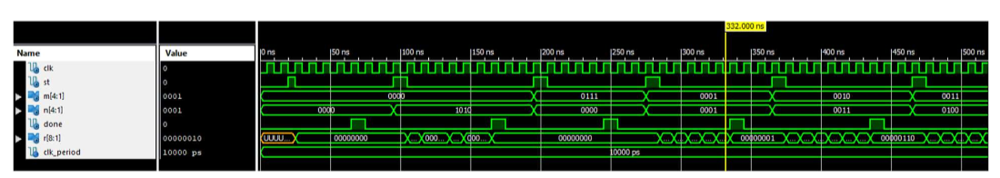

# FSM Multiplier Controller (VHDL)

A 4-bit sequential binary multiplier implemented in VHDL, built around a single system-controller FSM. Designed for Xilinx ISE 14.7.

## Overview

The circuit takes two 4-bit inputs (`M`, the multiplicand, and `N`, the multiplier) and a `START` signal, and produces an 8-bit product (`R`) along with a `DONE` signal.

The controller implements the classic shift-and-add multiplication algorithm:
- The multiplier is scanned one bit at a time, LSB first.
- If the current bit is `1`, the multiplicand is added into the upper bits of the accumulator.
- The accumulator is then shifted right, regardless of whether an add occurred.
- After 4 rounds (8 clock cycles total), the final product is ready and `DONE` asserts.

## Design

The controller is implemented as a single behavioral process using a 9-bit accumulator register (`ACC`). The least significant bit of the accumulator doubles as the current multiplier bit being examined (via the `Z` alias), and the FSM's state number tracks progress through the 10-state sequence (idle → 4x [add-or-skip, then shift] → done).

Key design points:
- Fully rising-edge triggered — the controller only ever acts on values already stable from the previous clock cycle, which avoids race conditions between state transitions and data updates.
- The accumulator serves double duty as both the multiplier storage and the growing product, which keeps the design compact at the cost of separating control and datapath into distinct components.

## Testbench

`controller_tb.vhd` is a self-checking testbench that instantiates the controller and runs 17 test vectors, covering zero operands, small values, mid-range values, asymmetric inputs, and edge cases (`15 × 15`). For each vector it:
- Pulses `START`, waits for `DONE` with a timeout guard
- Computes the expected product independently
- Compares it against the circuit's output and reports `PASS`/`FAIL` per vector

## Simulation

Waveform showing `CLK`, `ST`, `M`, `N`, `DONE`, and `R` across several multiplication cycles. The `DONE` signal stays low during computation and pulses high once each product is ready.

## Files

| File | Description |
|---|---|
| `controller.vhd` | Multiplier controller (FSM + datapath) |
| `controller_tb.vhd` | Self-checking testbench |
| `waveform.png` | Simulation waveform showing correct operation |
